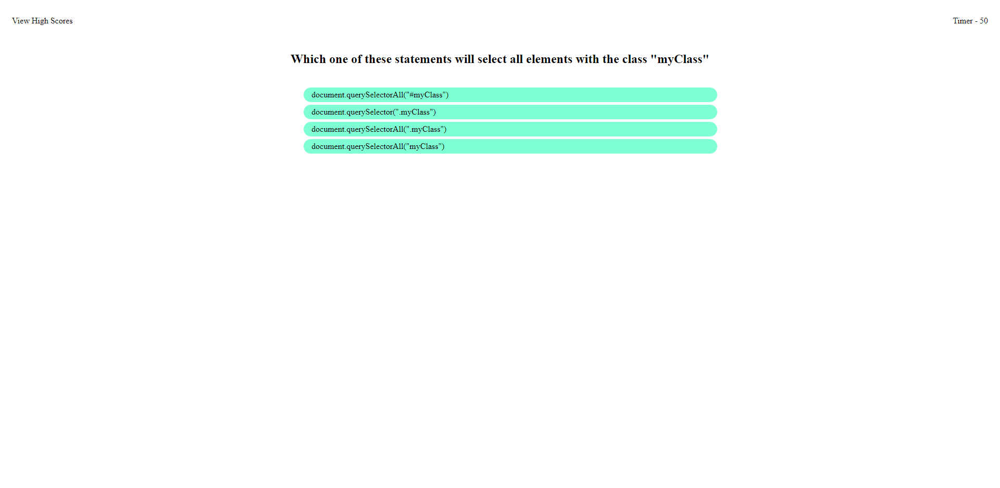

# Javascript Code Quiz

## Description

Test your javascript knowledge with this timed quiz - with a (local) scoreboard!

In this project I have created a timed quiz to help practice similar coding quizzes that are given in job applications. 

New concepts that I am demonstrating are DOM manipualtion and the use of localStorage and JSON to store data. 

Here is a screenshot of the page:

## Usage

The website can be accessed here: https://rileylum.github.io/code-quiz/

Click the 'Start Game!' button to begin the quiz.

## Credits

The MDN documentation on the DOM and localStorage we're very helpful in the creation of the webpage.

https://developer.mozilla.org/en-US/docs/Web/API/Document_Object_Model
https://developer.mozilla.org/en-US/docs/Web/API/Window/document
https://developer.mozilla.org/en-US/docs/Web/API/Window/localStorage
